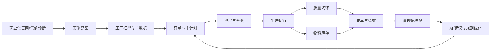

# 铸云智造产品设计思路

## 1. 一句话判断

这类系统不能按“功能菜单”设计，而要按“一家公司如何把订单变成可交付产品”设计。

铸云智造的核心不是做一个 MES、ERP 或看板工具，而是做一个制造企业的运营协同层：上接 ERP/销售/采购/财务，下接车间现场/设备/质检/仓储，把计划、执行、异常、成本和管理决策放在同一个可追溯系统里。

## 2. 对标后的产品结论

黑湖的强项是云端协同、移动端现场、快速实施、按需配置、工厂订单/排程/物料/生产/质检/设备全场景覆盖。海外大型 ERP 的成熟逻辑是把制造放在端到端企业流程中：设计到生产、预测到计划、订单到交付、采购到付款、库存到履约、生产到成本、质量到改进。

所以我们的产品设计应采用“双层逻辑”：

1. 对现场用户，系统必须像黑湖一样轻：打开就知道今天干什么，扫码、报工、质检、发料、异常上报都要快。
2. 对管理和 IT 用户，系统必须像大型 ERP 一样稳：主数据、权限、审计、流程、接口、成本、质量、批次追溯必须严谨。

## 3. 产品服务的真实公司

假设客户是一家年营收 10-50 亿的制造集团：

- 有 3 个工厂、20 条产线、几百名现场工人。
- 已经有财务 ERP，但生产现场依然大量依赖 Excel、微信群、纸单和人工催单。
- 管理层最痛的是交期不透明、库存高、质量追溯慢、计划变更靠人盯、成本差异解释不清。
- IT 最担心的是系统上线慢、主数据脏、接口复杂、现场不愿用。
- 现场最抗拒的是录入太多、页面太复杂、系统只服务管理层不服务一线。

因此产品的第一原则是：让每个角色都觉得系统是在帮自己完成当天工作，而不是被动填报。

## 4. 公司怎么拿起来用

### 4.1 采购前：价值诊断

客户先从商业化官网进入，选择适合自己的套餐：

- 单工厂先选 Starter，目标是 4-8 周跑通样板产线。
- 多产线选择 Professional，目标是把 APS/MRP、生产、质量、库存和 ERP 集成打通。
- 多工厂集团选择 Enterprise，目标是统一集团经营指标、权限、主数据和扩厂复制。

售前不是讲功能清单，而是和客户一起算四个 ROI：

- 准交率能提升多少。
- 库存和 WIP 能降多少。
- 质量追溯和偏差关闭能快多少。
- 纸单、人工统计、跨部门催单能减少多少。

### 4.2 上线前：实施蓝图

客户签约后，不直接“开账号让用户摸索”，而是先建蓝图：

- 建组织：集团、事业部、工厂、车间、产线、班组。
- 建角色：COO、计划员、生产主管、班组长、质检、仓库、采购、设备、财务、IT、供应商。
- 建主数据：物料、BOM、工艺路线、工位、设备、库位、检验标准。
- 建集成：ERP 订单、物料、采购、库存、成本凭证；PLM 的产品/BOM；WMS/IoT 的仓储和设备数据。
- 建试点范围：一条线、一个产品族、一个真实订单闭环。

### 4.3 上线后：角色日常

COO 打开总览工作台，看交付风险、产能负载、缺料、质量红线和 AI 建议。他不需要进入每个模块找原因，系统应该把“风险、影响、负责人、下一步动作”推到面前。

计划员每天从订单池开始，查看 MRP 例外、产线负载、缺料清单和推荐排程。计划员的核心动作不是录单，而是冻结计划、处理例外、评估变更影响。

班组长从生产执行进入，只看今天派工、当前工序、缺料、设备、质检点和异常。扫码报工、首件确认、异常上报要尽量少点几次。

质检员从质量闭环进入，处理首检、巡检、终检、偏差、CAPA 和批次追溯。系统必须能回答“哪个批次、哪道工序、哪个物料、哪个设备、哪个人”。

仓库和物料员从物料库存进入，围绕齐套、备料、发料、退料、盘点、库位、批次和安全库存工作。

财务和成本会计不关心现场按钮，而关心 WIP、物料消耗、工时、报废、返工、价差和 ERP 过账是否一致。

IT/实施顾问负责模板、权限、规则、接口、审计、字段和流程配置，确保系统可复制，而不是每个工厂都做定制项目。

## 5. 系统设计逻辑

### 5.1 第一层：业务对象

系统必须先有稳定对象，而不是先画页面：

- Tenant：租户/客户公司。
- Organization：集团、事业部、工厂、车间。
- Plant Model：产线、工位、设备、仓库、质检点。
- Product Model：物料、BOM、工艺路线、SOP、检验标准。
- Demand：销售订单、预测、客户交期、优先级。
- Plan：主计划、排程、MRP、缺料、产能约束。
- Execution：工单、工序、报工、异常、完工。
- Inventory：库存、库位、批次、齐套、收发退补。
- Quality：检验任务、偏差、CAPA、追溯、放行。
- Cost：WIP、耗料、工时、报废、成本差异。
- Integration：ERP、PLM、WMS、IoT、Webhook、API。
- Audit/Event：所有关键动作的事件流和审计轨迹。

### 5.2 第二层：流程闭环

核心流程不是单点功能，而是连续闭环：

系统的产品价值在于：每个动作会改变下游状态，每个异常能回到上游修正，每个决策都有数据依据。

### 5.3 第三层：角色工作台

大型 B 端系统不能让用户先选模块。正确做法是让角色先看到任务：

- 管理层看到风险和指标。
- 计划员看到例外和可执行排程。
- 班组长看到今日派工。
- 质检看到待检和偏差。
- 仓库看到缺料和待发料。
- 财务看到成本差异。
- IT 看到接口、权限和审计。

模块是系统组织方式，工作台才是用户进入方式。

### 5.4 第四层：配置与模板

制造企业差异很大，不能用硬编码流程做产品。系统应把差异沉淀成配置：

- 行业模板：食品饮料、电子装配、汽车零部件、医药日化、装备制造。
- 流程模板：生产变更、质量 CAPA、采购审批、异常升级。
- 表单模板：报工、质检、点检、收货、发料、盘点。
- 规则模板：缺料预警、交期风险、质量红线、设备停机、库存补货。
- 看板模板：经营看板、车间看板、质量看板、仓储看板。

这也是商业化的关键：卖的不只是软件功能，而是“行业最佳实践 + 可复制上线方法”。

## 6. 产品体验原则

1. 少解释，多行动：用户进入页面就看到下一步，而不是读说明。
2. 管理层看风险，执行层看任务，IT 看配置，财务看差异。
3. 所有关键数据必须有来源、负责人、状态、影响对象和更新时间。
4. AI 不能只是聊天，必须转成可确认、可审计、可回滚的业务动作。
5. 页面密度要高，但层级要清楚；企业系统不是营销站，也不是消费 App。
6. 移动端只做现场高频动作，桌面端做计划、分析、配置和复盘。
7. 配置优先于定制，模板优先于从零实施。

## 7. 商业化设计逻辑

这套产品应按“客户成熟度”售卖，而不是按菜单售卖：

| 客户阶段 | 售卖产品 | 核心承诺 | 成功信号 |
| --- | --- | --- | --- |
| 数字化起步 | Starter 首厂试点 | 一条样板线跑通生产/质量/物料闭环 | 现场愿意用，纸单减少，报工及时 |
| 多产线协同 | Professional 多产线协同 | 计划、排程、库存、质量、ERP 集成联动 | 缺料和插单能被系统提前发现 |
| 集团复制 | Enterprise 集团运营 | 多工厂指标、权限、模板和扩厂复制 | 管理层能跨厂看同一套指标 |
| 行业深化 | Industry Pack | 行业流程、表单、规则、合规要求预置 | 实施周期缩短，模板可复用 |

销售路径应是：

1. 官网承接需求。
2. 生成售前方案。
3. 做 ROI 诊断。
4. 选择试点线。
5. 4-8 周上线。
6. 管理层复盘价值。
7. 多产线、多工厂扩展。

## 8. 当前产品应继续补强的方向

从“像完整产品”到“真的生产级”，下一步不应该继续无序加页面，而要围绕以下方向补：

1. 用户引导：不同角色首次登录后有自己的初始化路径和空状态。
2. 主数据导入：物料、BOM、工艺、设备、人员、库位要有导入校验和错误处理。
3. 权限体系：角色、工厂、产线、字段级权限、审批权限。
4. 商机到实施：商业化官网生成商机后，应能一键进入实施蓝图。
5. 实施蓝图到配置：蓝图阶段完成后，应自动生成角色、模块、流程和看板模板。
6. 现场移动端：班组、质检、仓储需要更接近 PDA/手机真实操作。
7. 端到端追溯：从客户订单到工单、物料批次、质检、成品入库、成本凭证。
8. 系统可信度：测试、错误码、审计、幂等、接口健康、数据权限需要产品化呈现。

## 9. 最终产品形态

最终用户看到的不是“一个功能很多的 demo”，而是一套可持续运营的制造 SaaS：

- 对老板：这是经营风险驾驶舱。
- 对计划：这是排程和例外处理系统。
- 对车间：这是每日派工和报工工具。
- 对质量：这是检验、偏差和追溯系统。
- 对仓库：这是齐套、库存和批次流转系统。
- 对财务：这是生产成本和差异解释系统。
- 对 IT：这是可配置、可集成、可审计的平台。
- 对销售：这是能讲清 ROI、套餐、行业包和实施路径的商业化产品。

这就是铸云智造应该坚持的设计主线：用 SaaS 的轻交付和低门槛，承接 ERP 级的业务严谨性，再用 AI 把复杂制造异常转成可执行动作。

## 10. 参考资料

- 黑湖智造官网：https://www.blacklake.cn/
- Microsoft Dynamics 365 Plan to Produce：https://learn.microsoft.com/en-us/dynamics365/guidance/business-processes/plan-to-produce-overview
- SAP Cloud ERP Manufacturing：https://www.sap.com/products/erp/s4hana/features/manufacturing.html
- Oracle Manufacturing：https://www.oracle.com/scm/manufacturing/
